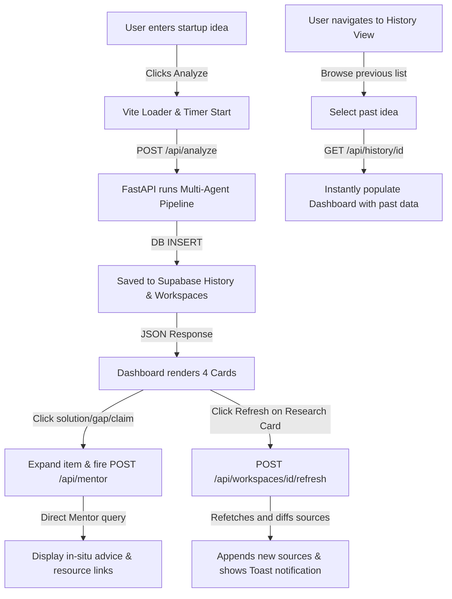

# Insights Copilot V2: Comprehensive Project Analysis Report

This report provides a detailed breakdown of the current state of the **Insights Copilot** project, detailing what has been implemented, what is partially complete, what is missing, and the technical debt/issues that should be addressed before proceeding.

---

## 📊 Summary of Development Stage

The project is currently in the **Advanced MVP (Minimum Viable Product)** stage. 

* **The Core AI Agent Pipeline** is highly robust, featuring multiple specialized agents running on Groq (Llama 3.3 70B) and integrating with real-world APIs (Tavily, GitHub, arXiv, Semantic Scholar).
* **The Database Layer** has been migrated from local SQLite to Supabase, enabling cloud-based persistence.
* **The Frontend** is a fully functional React + Vite light-themed dashboard that renders real-time analyses, interactive Mermaid architecture diagrams, execution roadmaps, and historic case files.
* **The Telegram Bot** is fully programmed for task tracking and interactive mentoring but lacks a frontend gateway (integration links) to allow users to connect easily.

---

## 📁 Directory Structure & Architecture

The workspace is organized into a clean **decoupled monorepo** structure with separate `frontend` and `backend` services.

```
insights-copilot/
├── backend/
│   ├── main.py                 # FastAPI Application Entry & Lifecycle Management
│   ├── agents.py               # 4-Agent Orchestration & API Client Fetchers
│   ├── db.py                   # Supabase Database client & dummy fallback
│   ├── supabase_schema.sql     # Database tables and constraints schema
│   ├── requirements.txt        # Python backend dependencies
│   └── bot/                    # Telegram Bot module
│       ├── telegram_bot.py     # Bot entry point and polling configuration
│       ├── scheduler.py        # Background scheduler for milestone reminders (APScheduler)
│       └── handlers/           # Commands & message routing
│           ├── start.py        # /start handler (links bot to workspace)
│           ├── status.py       # /status handler (shows current milestone checklist)
│           ├── done.py         # /done handler (progresses to next milestone)
│           └── question.py     # Message handler (routes Q&A to AI Mentor)
└── frontend/
    ├── index.html              # Main HTML entry
    ├── tailwind.config.js      # Tailwind CSS configuration
    ├── vite.config.js          # Vite server configuration
    ├── package.json            # NPM dependencies (React, Tailwind, Mermaid, Lucide)
    └── src/
        ├── App.jsx             # React Application Entry and State Controller
        ├── main.jsx            # Vite DOM mounting point
        ├── api.js              # Fetch requests to FastAPI endpoints
        ├── index.css           # Global stylesheets & design system entry
        └── components/         # Reusable presentation and interaction cards
            ├── Icons.jsx             # Predefined SVG wrappers
            ├── Sidebar.jsx           # Dark left-side navigation component
            ├── HistoryView.jsx       # Grid list to view and restore past ideas
            ├── ResearchCard.jsx      # Technical Analysis, Critique, and click-to-mentor details
            ├── ArchitectureCard.jsx  # Technical Feasibility & Mermaid charts parent
            ├── MermaidChart.jsx      # Dynamic SVG renderer for Mermaid diagrams
            ├── PlanCard.jsx          # Vertical timeline 5-step execution roadmap
            ├── ResourcesCard.jsx     # Hyperlinked listings for APIs, repos, and sources
            └── WorkspaceList.jsx     # [Unused] Old dark-themed workspace sidebar
```

---

## 🛠️ Feature Matrix & Implementation Status

Below is the verification matrix detailing fully functional, partially implemented, and missing features:

| Module / Functionality | Feature Name | Status | Details / Current Capability |
| :--- | :--- | :--- | :--- |
| **Orchestration Agent** | Multi-Agent Pipeline | **Completed** | Chains **Research -> Planner -> Critic -> Mentor** agent calls sequentially. |
| **Research Agent** | Real-World API Fetching | **Completed** | Parallel calls to **Tavily** (web), **GitHub API** (repos), **arXiv** (XML parser), and **Semantic Scholar** (JSON). |
| | Search Query Optimization | **Completed** | Refines ideas into purpose-specific queries for market, academic, and code search. |
| | Academic Keyword Filter | **Completed** | Filters academic articles based on keyword overlap with stop-words exclusion. |
| | Research Refresh / Diff | **Completed** | Re-runs search queries, diffs against existing sources, logs new items, and updates database. |
| **Planner Agent** | Tech Stack & Timeline | **Completed** | Generates tailored lists of real tools and timeline estimates. |
| | Architecture Mermaid Generator | **Completed** | Generates dynamic, strictly formatted Mermaid.js diagrams of system structures. |
| | Roadmap Checklist | **Completed** | Formats an exact 5-milestone roadmap with detailed sub-tasks. |
| **Critic Agent** | Criteria Audit | **Completed** | Audits plans on accuracy, verifiability, scalability, and actionability. Flags issues and suggested fixes. |
| **Mentor Agent** | Contextual Q&A | **Completed** | Feeds workspace data (idea, research, plan) as prompt context to answer specific user queries. |
| **FastAPI Backend** | REST API Endpoints | **Completed** | API endpoints for analyze, health check, history, workspace refresh, and mentor Q&A. |
| | Background Bot Execution | **Completed** | Runs Telegram Bot polling on a concurrent daemon thread on app startup. |
| **Database Layer** | Cloud Persistence (Supabase) | **Completed** | Connects to remote PostgreSQL via Supabase Python SDK. |
| | Failover Mock client | **Completed** | Falls back to `DummySupabase` client to avoid crashes if environment variables are missing. |
| **Frontend UI** | Dashboard Layout | **Completed** | Fluid 4-column light dashboard display: Technical Analysis, Architecture, Roadmap, Resources. |
| | Real-Time Diagnostics | **Completed** | Displays an active loading timer reflecting API call duration. |
| | Dynamic Sidebar Navigation | **Completed** | Sidebar navigation panel styling active. |
| | Interactive Mermaid Rendering | **Completed** | `MermaidChart.jsx` parses and renders flowchart SVGs with interactive pan/scroll container. |
| | Dynamic Mentorship Popups | **Completed** | Clicking items in ResearchCard triggers expandable in-situ AI explanations from the Mentor. |
| | Workspace History restoring | **Completed** | Users can view all past submissions and click to instantly load them to the dashboard. |
| **Telegram Bot** | Workflow Sync (/start, /status, /done) | **Completed** | Commands correctly manage workspace links and progress milestone indexes. |
| | Background Notifications | **Completed** | APScheduler checks every 60m and sends reminders to chat IDs if time durations expire. |
| | Bot Frontend Connection | **Missing** | No frontend button or user-facing redirect to link the user's dashboard to the Bot. |
| | Sidebar Saved View | **Missing** | The "Saved" link in the sidebar is a dead link (defaults back to dashboard page). |
| | Sidebar Settings View | **Missing** | The "Settings" link in the sidebar is a dead link (defaults back to dashboard page). |
| | Local SQLite Mode | **Missing** | Local SQLite storage code was deleted in favor of Supabase, leaving no local offline option. |

---

## 🔄 Functional User Flows

The codebase currently supports four primary end-to-end user journeys:



### 1. Startup Idea Generation & Analysis Flow
1. User enters a startup idea (e.g., "AI IoT plant care app") into the dashboard input.
2. Clicking "Analyze" initiates a visual loading state with a real-time clock counter.
3. The backend runs query refinements, crawls web/repos/academic endpoints concurrently, synthesizes research findings, drafts a plan & architecture (with Mermaid.js), and criticizes the draft.
4. The backend saves the bundle to Supabase.
5. The frontend renders the technical analysis, Mermaid.js diagram, execution checklist, and resources.

### 2. Interactive Mentorship Flow
1. Once an analysis is generated, the user clicks on any specific *Existing Solution*, *Research Gap*, or *Unverified Claim* inside the Technical Analysis card.
2. The item expands, showing a loading indicator and firing a query to the Mentor agent.
3. The Mentor agent responds with a simplified explanation tailored specifically to the user's startup idea.
4. Additional reading links generated by the Mentor are displayed inside the expanded box.

### 3. Historical View Flow
1. User clicks the "History" tab in the sidebar.
2. The frontend requests all past submissions from `/api/history` and displays them as a chronological list with formatted Indian Standard Time (IST) timestamps.
3. Selecting an item queries the backend for the full payload and updates the dashboard state immediately without incurring new LLM costs or API lag.

### 4. Interactive Research Refresh Flow
1. The user views their dashboard and clicks the "Refresh" (rotating arrows) icon on the Technical Analysis card.
2. The backend re-runs search queries, compares the new links to the old sources, computes the diff, appends the new sources to the database workspace, and returns them.
3. The frontend displays a green "New" tag next to the fresh URLs and flashes a toast notification indicating how many new references were discovered.

---

## 🔌 API Documentation

| Endpoint | Method | Input Payload | Output Payload | Description |
| :--- | :--- | :--- | :--- | :--- |
| `/api/health` | `GET` | None | `{"status": "ok", "groq_configured": bool}` | Checks backend health and GROQ config status. |
| `/api/analyze` | `POST` | `{"idea": "string"}` | `{"workspace_id": "uuid", "research": {...}, "plan": {...}, "critique": {...}}` | Main execution pipeline entry. Saves history to database. |
| `/api/history` | `GET` | None | `[{"id": int, "idea": "string", "timestamp": "iso_date"}]` | Lists all historical inputs in reverse chronological order. |
| `/api/history/{id}`| `GET` | None (Route ID parameter) | Full result payload of the analyzed workspace. | Fetches all data for a specific history item to restore views. |
| `/api/mentor` | `POST` | `{"idea": "str", "research": {}, "plan": {}, "question": "str"}` | `{"answer": "string", "learning_resources": [...]}` | Connects direct questions or list expansions to the Mentor Agent. |
| `/api/workspaces/{id}/refresh` | `POST` | None (Route Workspace ID) | `{"research": {...}, "new_source_count": int, "new_sources": [...], "previous_fetched_at": "string"}` | Re-runs research searches, filters duplicates, updates database, returns diff list. |
| `/api/workspaces/{id}/telegram-link` | `GET` | None (Route Workspace ID) | `{"deep_link": "t.me link"}` | Builds the start parameter redirect URL to open Telegram. |

---

## ⚠️ Technical Debt & Known Issues

1. **Outdated Project README**: 
   * The root [README.md](file:///c:/Users/Lenovo/OneDrive/Desktop/insights-copilot/README.md) still references a local SQLite database (`insights.db`) and claims it generates it on startup. However, the database layer (`db.py`) has been fully refactored to use Supabase client code.
2. **Missing Telegram Frontend Gateway**:
   * The backend supports a `/telegram-link` endpoint, and the bot handlers are ready to process start deep links. However, the frontend lacks a "Connect Telegram" button or interface card to let users trigger this link.
3. **Dead Sidebar Items**:
   * "Saved" and "Settings" options exist in `Sidebar.jsx`, but clicking them defaults the main layout back to the homepage. There are no UI templates or components for these views.
4. **Unused / Conflicting Components**:
   * `WorkspaceList.jsx` is left in `frontend/src/components` but is not imported or used anywhere. It contains CSS properties styled with dark colors (`#101A33`), which conflict with the light-theme overhaul.
5. **No Local Persistence Fallback**:
   * If a developer clones the repository and runs it without configuring a Supabase project (`SUPABASE_URL` and `SUPABASE_KEY` missing), the database falls back to a Dummy mock object. The app will run, but History, Workspaces, and the Telegram bot states will not persist at all. There is no automatic fallback to SQLite.
6. **Hardcoded Ports & URLs**:
   * `frontend/src/api.js` hardcodes the production backend URL to an Onrender service URL (`https://insights-copilot-s35d.onrender.com`). If deployed elsewhere, developers must manually edit this file.

---

## 🧭 Recommendations for Next Steps

> [!TIP]
> Resolving these issues sequentially will prepare the application for production release:

1. **Integrate Telegram Bot Connection in Dashboard**: Add a button on the UI (perhaps in the Header or Plan card) that queries the `/telegram-link` endpoint and opens the link in a new tab.
2. **Update README.md**: Rewrite the database setup documentation to reflect the Supabase migration and provide instructions for running the sql migration in `supabase_schema.sql`.
3. **Clean Up Unused Files**: Delete `WorkspaceList.jsx` to keep the frontend repository clean and reduce package confusion.
4. **Add Settings Panel**: Implement a settings view to allow users to toggle themes, configure their own API keys, or switch between model configurations.
5. **Establish SQLite Fallback**: Configure `db.py` to use a local SQLite database if Supabase variables are not present, ensuring a developer can run a fully featured, persistent version of the app offline without cloud configuration.
